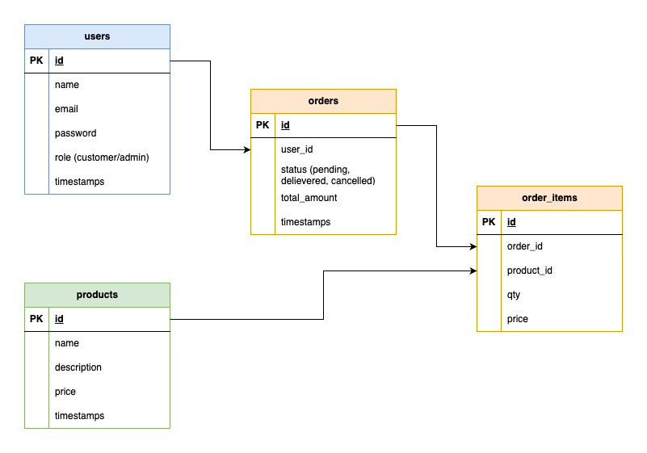

# Edstruments Task

## Project Overview
The goal is to create a Products CRUD API

---

## System Requirements
Ensure your system meets the following requirements before proceeding:

- Java 21
- Maven
- MongoDB running locally or cloud (e.g. MongoDB Atlas)

---

# Task 1
## Installation Instructions
1. Clone the repository:
   ```bash
   git clone https://github.com/aaqibgouher/cloudgov.git
2. Change directory:
    ```bash
    cd folder
3. Set up database:
    - make sure to setup edstruments_db (mongo db) locally
    - once done, please check the application.properties file if all good
4. Build the project:
    ```bash
   ./mvnw clean install
5. Run the application:
    ```bash
   ./mvnw spring-boot:run

## Postman Collection
I have also added postman collection, please import it while calling API's.

    ./edstruments.postman_collection.json

# Task 2
SQL and Database Design

I have added sql file & db design below, please take reference from here.

    ./ecommerce.sql

## DB Schema


I really enjoyed creating this task and building the Edstruments API from scratch! 🚀